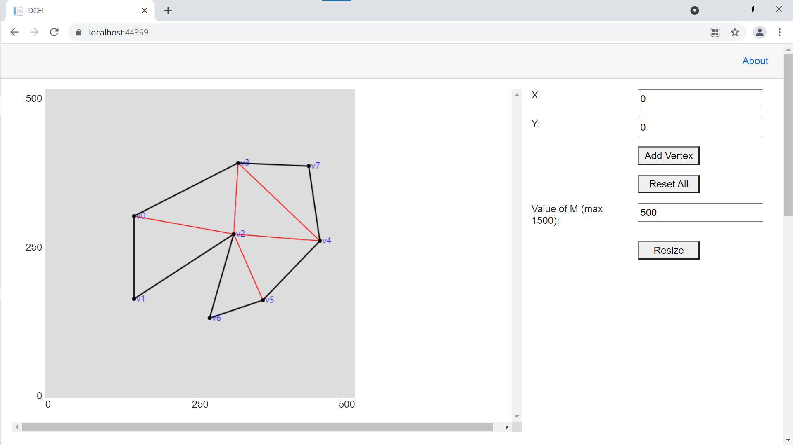
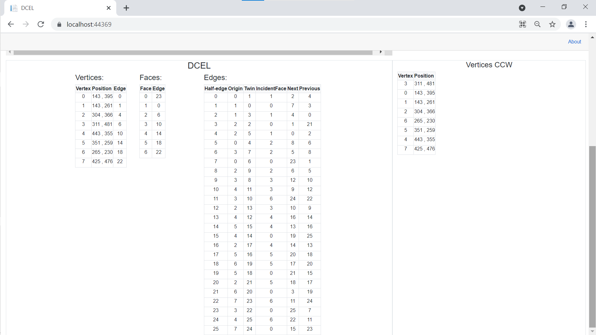
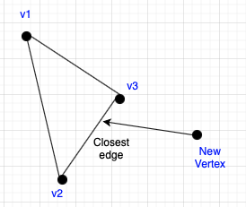
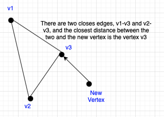
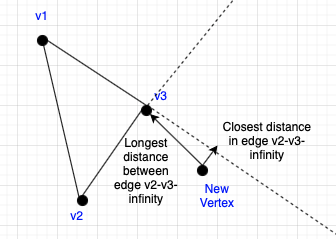

# DCEL
Implementation of the DCEL data structure using Blazor WebAssembly with an interactive GUI

  
  
 

 
 # ABOUT
To calculate that nearest edge, is used the function GetDistanceFromLineSegment, which
has time complexity O(n − 1), with n the number of vertices, since it goes through all the outer
edges to find the nearest one to the new vertex, and thus build the new triangle.

  
 

 
Sometimes the function GetDistanceFromLineSegment gives a draw between two edges, this case
happens when the closest distance to the new vertex from these two edges is the same final vertex
of the edge:

  
 

 
To solve this conflict, we use the function GetDistanceFromLine, that extend the edges to infinity,
and calculate the closest distance between the point and the lines, and, in this case, we use the
edge with the longest distance to the new vertex because in this case, the longest distance edge
means that it is the most perpendicular edge.

  
 

 
# HOW TO RUN
- Windows and MacOS: In order to run the program you need to have installed Visual Studio 2019. Open the solution
(DCEL.sln) with the Visual Studio and push the play button to run the web-app.

- Linux: You can run it in linux too, but it requires a more elaborated configuration since you have to use
Visual Studio Code. You can find how to configure the environment in linux by following the steps
on this website:
https://dev.to/rineshpk/blazor-server-crud-app-using-visual-studio-code-2b2g#:~:text=Blazor%20is%20a%20new%20Microsoft,C%23%2C%20HTML%2C%20and%20CSS.
 
 ## License

Distributed under the MIT License. See `LICENSE` for more information.
